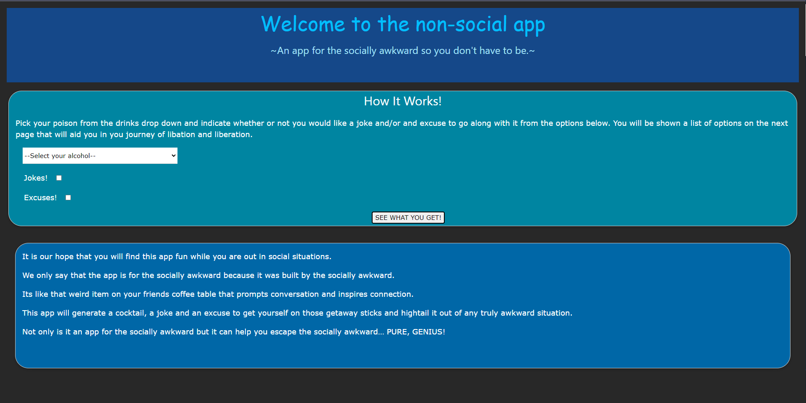
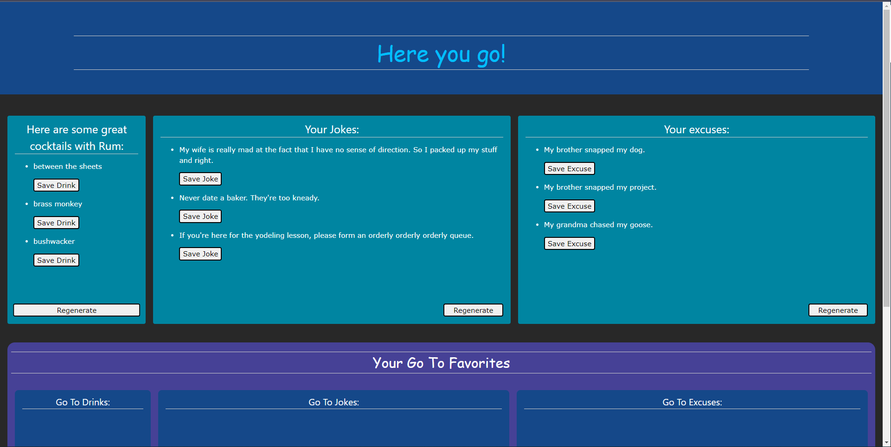
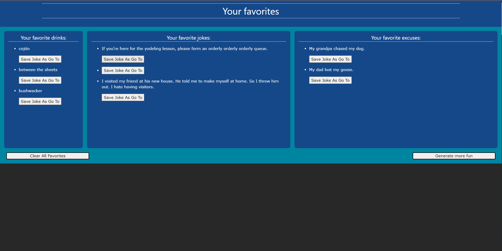

# The nonsocial-drinker app
 _An Application for Nonsocial People_

---
## Overview

The nonsocial-drinker app is a tool for those of us who prefer to keep to ourselves in crowds and busy social situations.

When one finds it difficult to decide on a drink, come up with something to say, or are just too darn nice to bail on the party in mid stream.  This app will help by generating an alcoholic mixed drink selection based off of your alcohol preference, ie. wiskey, rum, or vodka.  Then the user can choose to generate a joke and an axcuse to leave as well.

Give it a try and may find that this app will take away the friction in those awkward social situations.  Cheers!

---
## User story
- As a person who doesn't alway feel the most social in group outings:
    - I want an app that will aid me in swift and adventurous drink selections, display random jokes and excuses.
    - So that I can hang out for an evening with reduced anxiety among friends in any social situation. 

## Acceptance criteria

- When I am in a social situation:
    - Then I can limit the drink by the type of alcohol I want to use
    - Then I can generate a random drink.
- When I want to participate in a conversation:
    - Then I can choose from three randomly generated jokes... or heck, even use them all.
    - Then generate a random joke.
- When I want to leave the social event:
    - Then I can pick from one of three generated excuses from the nonsocial-drinker app.
- When I find jokes and drinks that I really like and excuses that really work:
    - Then I can save said drink, joke and/or excuse to a fovorites page for later use.
    - Then I can choose from those favorites as my "go to's"

---

## Mockup

## Links
app url:
https://trufl.github.io/nonsocial-drinker/

app github repo:
https://github.com/trufl/nonsocial-drinker

## Colaborators
Tristan S.
https://github.com/trufl

Gayle H.
https://github.com/hoeferg

Derrick L.
https://github.com/Derricklaff

Jerome N.
https://github.com/Jeromemn

Cole Sexson:
https://github.com/ColeS82
